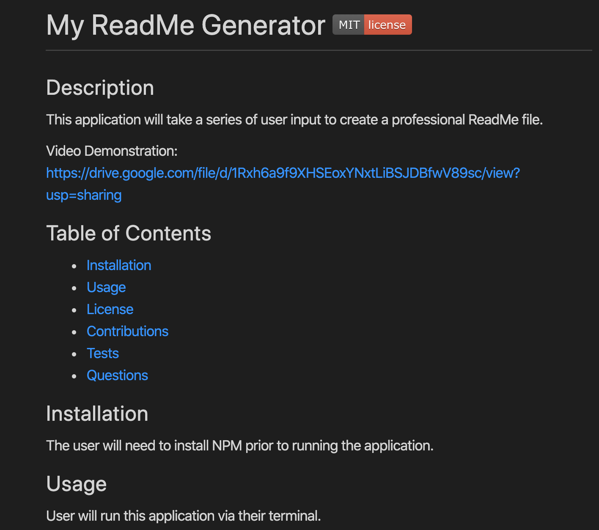

# Good ReadMe Generator 

## Description 
This application will prompt the user with a series of questions about their project and then generate a professional ReadMe file based on their input. This allows the user to save time instead of creating a ReadMe from scratch. 

Video Demonstration: https://drive.google.com/file/d/1Rxh6a9f9XHSEoxYNxtLiBSJDBfwV89sc/view?usp=sharing

</>

## Table of Contents
- [Installation](#installation)
- [Usage](#usage)
- [License](#license)
- [Contributions](#contributions)
- [Tests](#tests)
- [Questions](#questions) 
  

## Installation
The user will need to have NPM installed prior to running this application.

## Usage
The user will run this application using node in their terminal.

## License
Notice: This application is licensed under MIT.

## Contributions 
You may contribute to this application by forking the repository via my GitHub link below.

## Tests 
This application was run through NPM tests.

## Questions
Please feel free to view my GitHub profile at https://github.com/jeniglar or email me directly at jeniglar@gmail.com with any additional questions.
